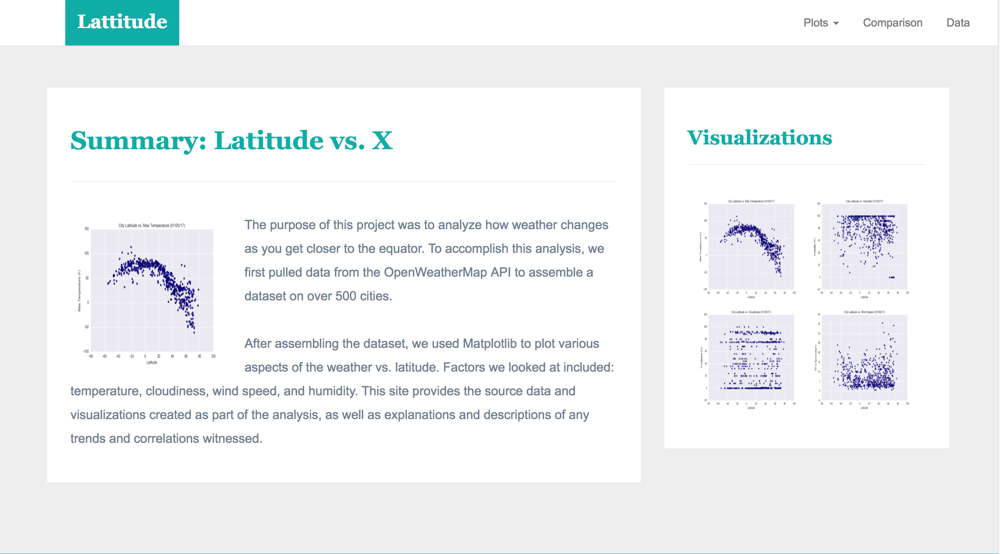
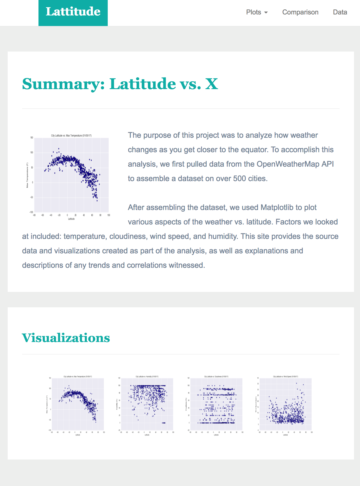
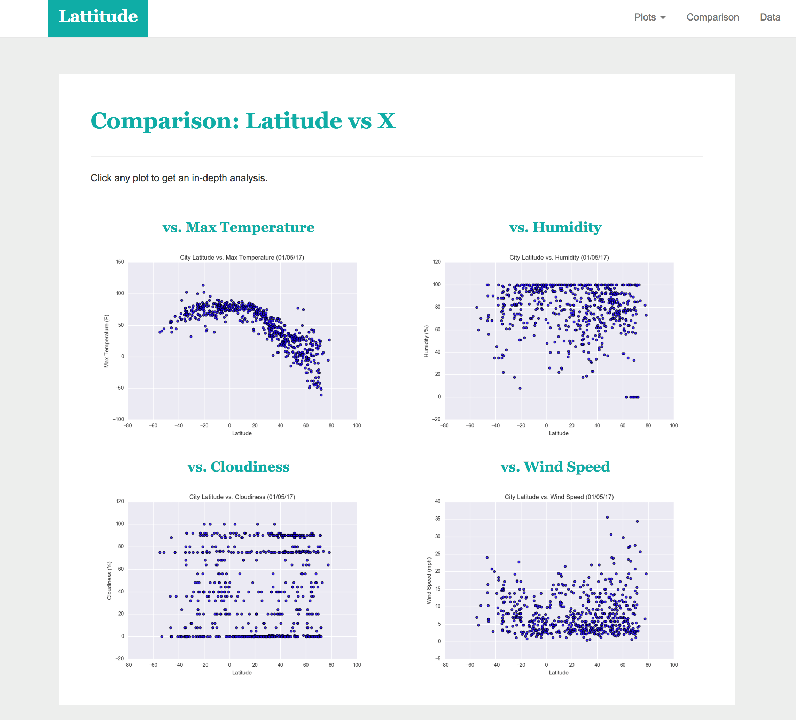
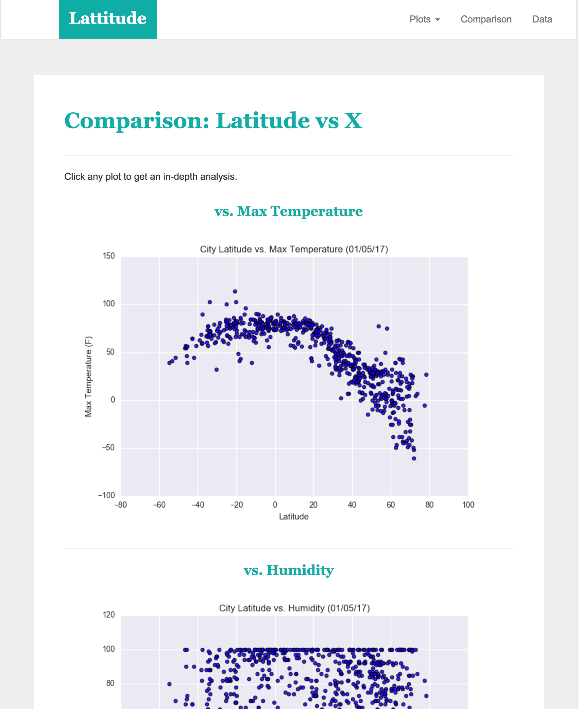
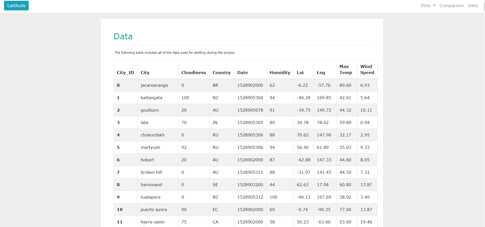
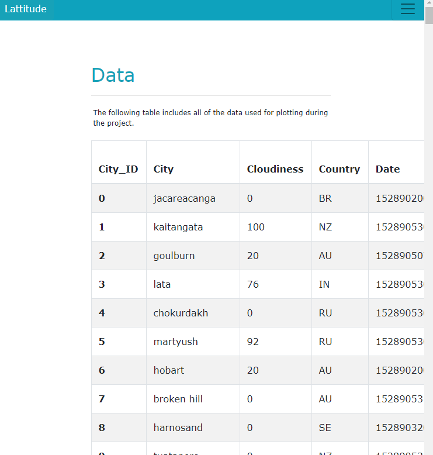
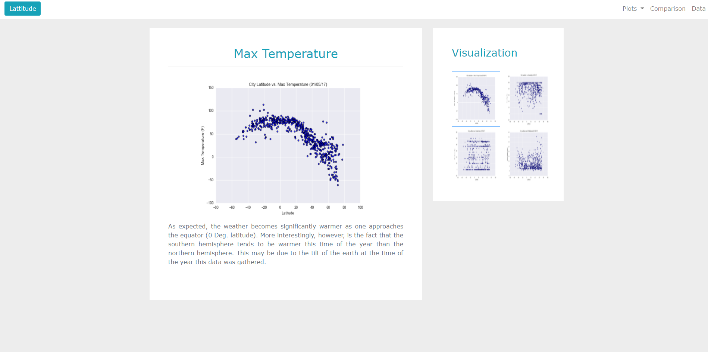
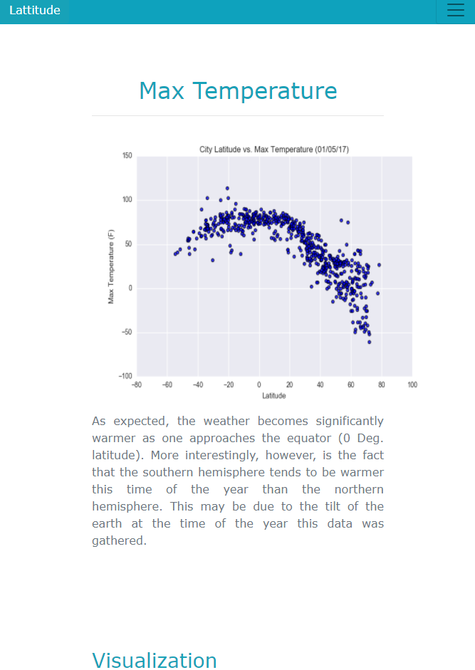
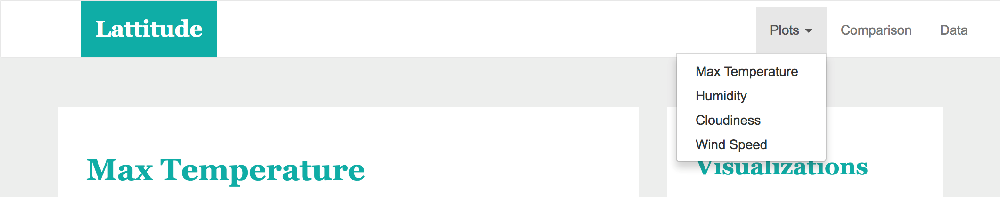
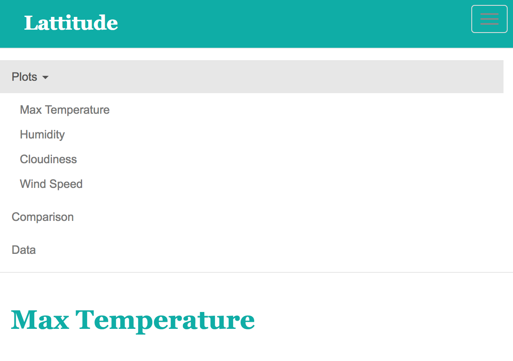

# Web_Design_Challenge

# Summary

Website deployed and be viewed here: https://rajeshnair1984.github.io/Web_Design_Challenge/index.html

## Screenshots

This section contains screenshots of each page, at varying screen widths.

#### Landing page

Large screen:

Small screen:

#### Comparisons page

Large screen:

Small screen:

#### Data page

Large screen:

Small screen:

#### Visualization pages

Large screen:

Small screen:

#### Navigation menu

Large screen:

Small screen:

